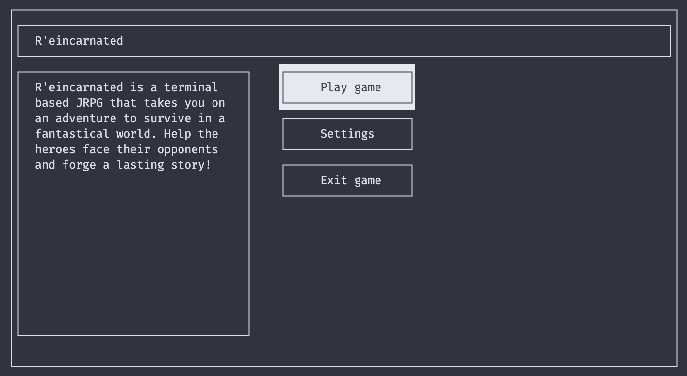
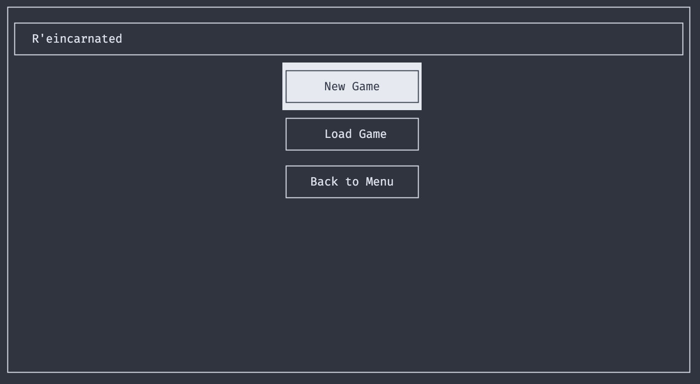
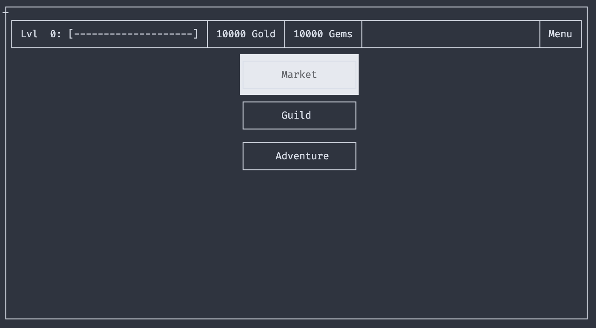
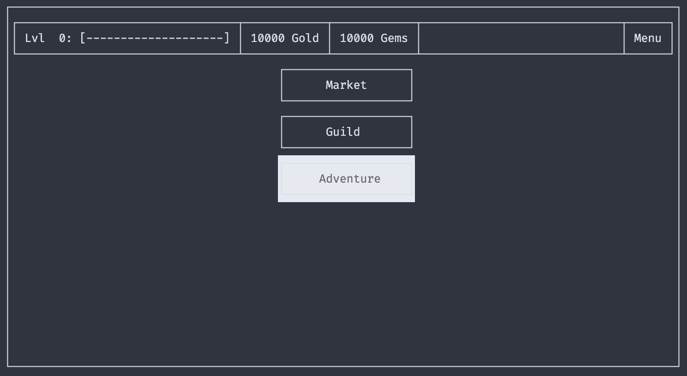
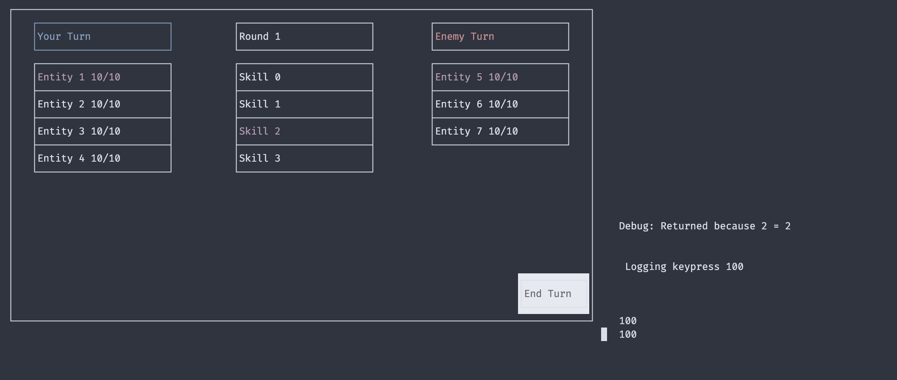
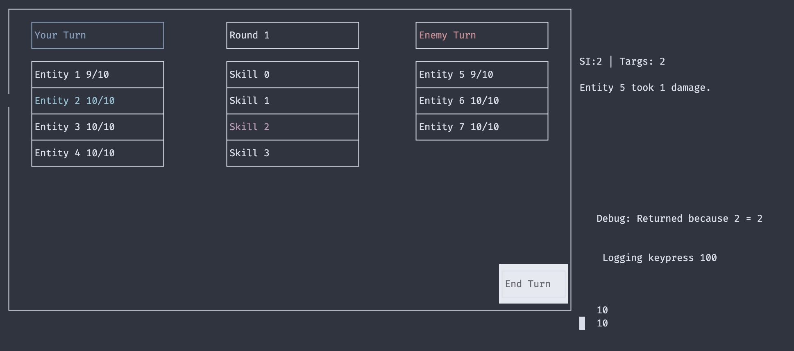

[](https://github.com/cs100/final-project-adung003-jhsu094-mwu171-jkim1369/actions/workflows/main.yml)

[](https://classroom.github.com/online_ide?assignment_repo_id=10873566&assignment_repo_type=AssignmentRepo)
# R'eincarnated
 > Authors: [AnPhu Dung](https://github.com/AnPhu-D), [Joshua Hsu](https://github.com/Dragonlinae), [Jake Kim](https://github.com/jakecreate), [Menthy Wu](https://github.com/menthy-wu)

## **Project Description**
### **What is our project** (Technical Aspects)?
Our team selected the **text-based RPG** option from the provided document, but decided we want to put a spin on the traditional storytelling oriented form of a text-based RPG and use escape sequences and box-drawing characters in order to implement a more [menu-like](https://faceted-twilight-d08.notion.site/Town-6399946cd8e24f0ea4114e05f59a79e4) feel to our game. Tieing into more popular game trends, we decided that the other main focus of our game would be a ['gacha'](https://en.wikipedia.org/wiki/Gacha_game) mechanic, where players will draw randomly from a pool of rewards.

### **What is our project** (Game Design)?
This game fits in a number of genres, inlcuding: RPG, Text-Based, Gacha, Permadeath, Roguelike

### **What is our project** (The Story)?
The game (tentatively) follows a group of students who have been mysteriously transported from their world into another reality, one with swords, magic, and monsters. There's just one twist though, they're stuck in a boundless purgatory between worlds. 
####
One student, however, is luckily transported into the fantastical world of \<insert world name here>. They will have to survive alone in this new world until they can bring their fellow classmates out of purgatory and into this new world.  
#
### **Why is this project interesting?**
Our project encompasses a number of unique technical challenges that would otherwise not normally be found in text-based RPGs, such as devising a way to create and display the menu-like text and allow for it to be interacted with. In addition to the challenges, the story and gameplay should also prove to be interesting to the player.
#
### **What is our techstack?**
For our langauge, we will be using exclusively (STC) C++ with only standard C++ or C libraries. As our game will output text to the console, we do not need any graphical display libraries.
#
### **What will be the input/output of our project?**
As briefly mentioned beforehand, our project will focus on generating menu-like displays using text. So, our output will be in the form of a text-styled output. Our game's required input should be a number of navigational keys (arrows), as well as a number of shortcut keys depending on the menu context.
#
### **What are the features that the project provides?**
* Implement optimized menu-like text generation and rendering for the game. (Potentially with layers like z-indexing)
  * Ability to create 'frames' that contain text with modifiable properties, i.e. left, right, center align.
  * Ability to render higher level z-index frames over lower index ones.
  * (If necessary for smoothness) Avoid re-rendering all characters on console by maintaining knowledge of previous screen state.
* Implement combat mechanics
  * Implement turn/initiative system for determining who goes next/first.
  * Implement attacks, defending/evading, items, retreating
  * Incorporate character stats i.e. strength, etc. into calculations for damage, defense, etc.
* Implement characters, classes, items, locations, skills
  * Have at least: Fighter, Wizard, Rogue, Knight
  * Implement spawn town (Market, Inn, Guild, Summoning)
  * Implement at least 4 distinct skills for each class
  * Implement at least 2 sets of equipment for each class
* Implement tutorial(s)
  * Implement combat tutorial
  * Implement summoning tutorial
  * Implement menu/town tutorial
* TBD

#
## **User Interface Specification**
We have created a [figma prototype](https://www.figma.com/file/m8Yi3pAwhPbGvZSCaWAzhC/Untitled?type=design&node-id=0%3A1&t=3ENp0Gzt2KJIVEYR-1) of what our game will look like in terms of visuals and navigation. We also have a navigation diagram [here](https://www.planttext.com/api/plantuml/png/VLDDZzf03BtFh_2f2eSUsjx2PIcjK2MeTZUelUnb88POp4Sw7o3-VPsPX6INRMyPFzllFTjvy46w4BKI8b1G24jhQWfaZLJm4HRxG6SAL_X6ykYa1Y54gX223b0yAdcTGMZGGF4JBx2I6cS2eEm-eEeIOHc3twF1UHTVMhsJ0ROnM4TIfLWLjRQ6p74IHkKHYhMLTTzJ8Ciw275fI66njHSp0_9P0PTomi6waoWtqfqmT7tJkslFFH4MGmZaKP8PWQztGAQugUfvebA91o3PspSIAbIuxqOrJz6UaE4jeODFO_JMUi0-_mVxaZ7sEpZ8RC_eeqhE64eQeM0BhOTsr9PAnLWzOIXNaLGzcKpVuuVnBTk0HrxMDPkLlSriC2ClPeDwX-wjrsVKzep_ofcwMpRI715ooelv_YTIgz64zxD_4T_Ja5kTI2d_TZ3Z75ZmtNfN6E0feXz6TZUFHNrczkZuCilVrgaQDhATNivQxgwEJ6Zcjwl8zvkdDDIFPx6szjM2ydxwlRnMbmctJfvHJGMAwKVlxYbIO8DbnSdm0RhdlFiDRIl40wVnt_iN). (If the link does not work then please contact one of us via email.)

## **Class Diagram**
We used diagrams.net to generate [our class diagram](https://drive.google.com/file/d/1nEJQBlHIptW9avhxuoIwVmhfcUQBk8BB/view?usp=sharing) which can be found at the hyperlink. You can reference the diagram legend below in order to further understand the design choices of the UML diagram.

#

### **ScreenRenderer (Concrete)**
The ScreenRenderer is a singleton whose sole responsibility is to handle any and all matters related to printing to the console. It has methods which allow the internal API to draw frames, images, and more.

### **ScreenGUI (Concrete)**
The ScreenGUI is a container for all frames that are to be rendered to the screen. There can be multiple ScreenGUIs, which can be assigned one at a time to the ScreenRenderer singleton to be displayed. For example, there could be a main menu ScreenGUI, an options ScreenGUI, a combat ScreenGUI, etc.

### **Frame (Concrete)**
The Frame is a container which composes components and aggregate FrameVertexes. The frame is used to keep track of which vertexes are on the corners of the frame, and will handle functionality of buttons and text input fields such as highlighting buttons when they player moves their selection cursor to them.

### **FrameVertex (Concrete)**
The FrameVertex is a simple struct with getters/setters for 4 booleans which represent incoming edges. This determines which box-drawing character should be displayed at the vertex. Note that the lifetime of a vertex is tied to the ScreenGUI it is a member of, and not the Frame, as multiple frames could have a reference to the same vertex. Also note that not every Vertex is assigned to a Frame.

### **FrameComponent (Abstract)**
An abstract class that serves as an interface for various types of frame properties.

### **Widget (Abstract) : FrameComponent** 
Represents components that handle user input.

### **TextInput (Concrete) : Widget**
Contains text, textcolor, and other methods related to allowing a user to type in input in a frame.

### **Button (Concrete) : Widget**
Contains buttonText, textColor, and onPress() method for dispatching pressed event to event handler.

### **Sprite (Abstract) : FrameComponent**
Serves as an interface for components that use images.

### **StaticSprite (Concrete) : Sprite**
A Sprite that only has 1 frame and is static, i.e. background image or nonanimated character.

### **AnimatedSprite (Concrete) : Sprite**
A Sprite that has more than 1 frame (looping frames) that represents an animation contained within a certain space. Contains relevant animatoin information.

### **Text (Concrete) : FrameComponent**
A static text display that can be written to by the system but not the user, i.e. EXP display or money display.

#

### **InventoryItem (Abstract)**
Interface for all items in game.

### **LootItem (Concrete) : InventoryItem**
Items that can be stacked and looted, i.e. mob drops. Contains quantity.

### **QuestItem (Concrete) : InventoryItem**
Item that is relevant to completion of a quest that is not a collection quest, i.e. nondestructible items. Contains reference to quest that it is a part of.

### **WeaponItem (Concrete) : InventoryItem**
Item that contains damage and a weaponType and related getters.

### **ArmorItem (Concrete) : InventoryItem**
Item that contains defense and an armorType and related getters.

### **ConsumableItem (Concrete) : InventoryItem**
Contains int array representing which stats it will increase.

### **BackpackItem (Concrete) : InventoryItem**
Contains storageCapacity used when exitting a dungeon with loot.

#

### **Entity (Concrete)**
Represents a player character or enemy with stats, role, skills, position, and related getters/setters.

### **Role (Abstract)**
Contains roleName and provides interface for specialized role functions.

### **Skill (Abstract)**
Contains skillName, damage, targets, and provides interface for specialized skill functions.

#

### **Session (Abstract)**
Contains a widget and event handler, provides interface for other types of sessions. Controls what kind of GUIs are displayed and hooks onto any widgets like buttons or textinputs that are present in the GUI in order to make decisions about what should be rendered next or what internal logic needs to take place.

### **BattleSession (Concrete) : Session**
Contains extra information for a session related to combat, such as turn order, methods to use one entity to attack another entity with a certain skill, use items, etc.

### **MenuSession (Concrete) : Session**
Handles pure GUI sessions such shops, main menu, options, quest list, party management.

#

### **Handler (Abstract)**
Listener for events. Provides interface for more specific event listeners.

### **WidgetHandler (Concrete) : Handler**
Handles inputs from member widgets, has methods to add and remove widgets and their event connections.

### **EventHandler (Concrete) : Handler**
Handles generic event launches and has methods to add/remove events and their connections.

### **Event (Concrete)**
An event that can be triggered to signal for something to happen via the EventHandler.

#

### **Location (Concrete)**
Contains a string name, image data for background and foreground, and methods to get and set fore/background.

#

### **GameManager (Concrete)**
High level singleton that manages all game state and aggregates all low level singletons and services.

#

## SOLID Updates

### _HighlightService
We opted to use a highlight service singleton to help manage the highlighting of buttons and text inputs. This service will be used by the ScreenRenderer to determine which characters should be highlighted and which should not. This follows the SOLID principle of single responsibility as the ScreenRenderer should not be responsible for determining which characters should be highlighted, but rather should be responsible for rendering the highlighted characters. It also follows the SOLID principle of dependency inversion as the ScreenRenderer is dependent on the abstract HighlightService class, and not the concrete implementation of the HighlightService to determine which characters should be highlighted.

### _CursorService
Similarly, we opted to use a cursor service singleton to help manage the cursor position of the player. This service will be used by the ScreenRenderer to determine where the cursor should be rendered. This follows the SOLID principle of single responsibility as the ScreenRenderer should not be responsible for determining where the cursor should be, but rather should be responsible for rendering the cursor. It also follows the SOLID principle of dependency inversion as the ScreenRenderer is dependent on the abstract CursorService class, and not the concrete implementation of the CursorService to determine where the cursor should be.

### Handler
We decided to no longer have widgetHandler be a Handler to better conform to the SOLID principle. After analyzing the functionalities of widgetHandler, we decided that it would be better for the Liskov Substitution Principle if widgetHandler was not a Handler. This is because widgetHandler does not have the same functionalities as EventHandler, and therefore should not be a Handler. Instead, we decided to have rename widgetHandler as widgetContext for clarity, and made it its own separate class.

### Widgets
On the topic of widgets, we created new widgets to suit our needs. One such widget is the scrollingWidget. As our widgets were desigend with the open-closed principle in mind, we decided to create a new widget that would allow for text wrapping. This is because we did not want to modify the existing widgets to allow for text wrapping, as this would violate the open-closed principle (closed for modification). Instead, we decided to create a new widget that would allow for text wrapping, and would inherit from the existing widgets. This way, we would not have to modify the existing widgets, and we would be able to add new functionality to our game. And since we followed the open-closed principle, we were able to easily extend the capabilties of the widgets to include this new addition.
 
 > ## Final deliverable
 > All group members will give a demo to the reader during lab time. ou should schedule your demo on Calendly with the same reader who took your second scrum meeting. The reader will check the demo and the project GitHub repository and ask a few questions to all the team members. 
 > Before the demo, you should do the following:
 > * Complete the sections below (i.e. Screenshots, Installation/Usage, Testing)
 > * Plan one more sprint (that you will not necessarily complete before the end of the quarter). Your In-progress and In-testing columns should be empty (you are not doing more work currently) but your TODO column should have a full sprint plan in it as you have done before. This should include any known bugs (there should be some) or new features you would like to add. These should appear as issues/cards on your Project board.
 > * Make sure your README file and Project board are up-to-date reflecting the current status of your project (e.g. any changes that you have made during the project such as changes to your class diagram). Previous versions should still be visible through your commit history. 
 
 ## Screenshots
 > Screenshots of the input/output after running your application
#### Front Page

#### Session Page

#### Game Menu


#### Adventure Combat



 ## Installation/Usage
```bash
# clone with submodules (googletest)
git clone --recursive https://github.com/AnPhu-D/reincarnated.git
```

```bash
# complie program using cmake --> make
cd Frame_render_Prototype_3
cmake .
make
```

```bash
# run executable
./FrameRenderV3
```


 ## Testing
 We used CI to test our code, and included gcov and lcov to moitor code coverage. We have a build passing badge at the top left of this README.
